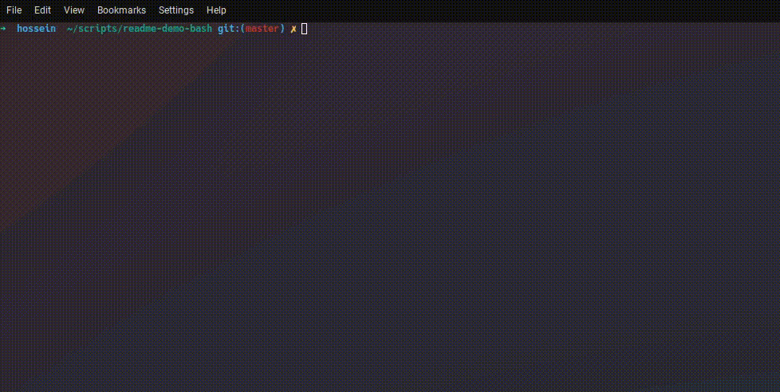

<h2 align="center">Hi there I'm Hossein Mousavi 👋
<!--    -->
</h2>

<!--
**hossein13m/hossein13m** is a ✨ _special_ ✨ repository because its `README.md` (this file) appears on your GitHub profile.

Here are some ideas to get you started:

- 🔭 I’m currently working on ...
- 🌱 I’m currently learning ...
- 👯 I’m looking to collaborate on ...
- 🤔 I’m looking for help with ...
- 💬 Ask me about ...
- 📫 How to reach me: ...
- 😄 Pronouns: ...
- ⚡ Fun fact: ...
-->

<!-- 

  

 -->

<h3>🛠 Skills, Languages and Tools</h3>
  

    
    
    
    
    
    
    
    
    
    
<!--  image credit: https://icons8.com/  -->
  

<h3>🔎 Find me on</h3>

    
    

<!-- 
  
 -->
